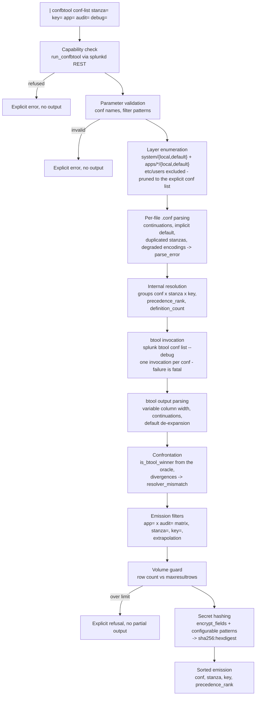

# SA-conf-audit

**btool as a search command.** `| confbtool` audits the file origin of every
Splunk configuration definition - winners and shadowed alike - in SPL, on the
member where the search runs.

For every `(conf, stanza, key)` it emits one row per *definition* (one file
that defines the key), with the file path, the global precedence rank, and the
verdict of a real `splunk btool <conf> list --debug` execution. The "winner"
verdict is **never** a reimplementation of the precedence rules: btool itself
is invoked as the oracle, and any disagreement between the internal ranking
and btool surfaces as an explicit `resolver_mismatch` row - the command
validates itself on every run.

The driving use case: on a search head, the effective precedence of a
parameter is opaque and shadowed definitions are invisible with native tools.
Auditing an app before removal - *what, in this app, is dead because another
layer shadows it?* - has no native answer. `| confbtool * app=<the_app>
audit=true` gives it in one search.

## Requirements

- Splunk Enterprise 9.x, on-premise (validated on 9.4.6). Not suitable for
  Splunk Cloud: the command executes the `splunk btool` binary and reads
  `$SPLUNK_HOME/etc` directly.
- Python 3 (the platform's `python.version = python3`). The Splunk SDK for
  Python is vendored under `bin/lib/` - no network access, no external
  dependency at install or run time.

## Installation

1. Package or copy the app into `$SPLUNK_HOME/etc/apps/SA-conf-audit` (the
   deployable archive carries `default/`, `bin/`, `metadata/`, `README.md`,
   `LICENSE`).
2. Restart Splunk (a new search command and a new capability are declared).
3. Nothing else: the app grants the `run_confbtool` capability to the `admin`
   role out of the box (`default/authorize.conf`).

The command is **admin-only by design**: it exposes the file origin of every
configuration parameter, which is administration data. Execution requires the
`run_confbtool` capability, checked at run time before any file is read.

### Granting the command to another role

Two steps, both local decisions (never shipped by the app):

1. Grant the capability in your own `authorize.conf`:

   ```ini
   [role_your_role]
   run_confbtool = enabled
   ```

2. Extend the app's visibility: `metadata/default.meta` restricts read access
   to the `admin` role, and Splunk `.meta` files restrict by **role**, not by
   capability. Add to `SA-conf-audit/metadata/local.meta`:

   ```ini
   []
   access = read : [ admin, your_role ], write : [ admin ]
   ```

   Without this second step the role holds the capability but does not see
   the command. The effective protection remains the run-time capability
   check; visibility is an interface comfort.

## Syntax

```
| confbtool <conf|conf,conf|*> [stanza=<pattern>] [key=<pattern>]
            [app=<pattern>] [audit=<bool>] [debug=<bool>]
```

- The conf list is positional and mandatory: one name (`authorize`), a comma
  or space separated list (`props,transforms`), or `*` for every conf present
  on disk.
- `stanza=`, `key=`, `app=` accept literal characters plus the wildcards `*`
  (any substring) and `?` (one character), case-sensitive. Defaults:
  `stanza=*`, `key=*`, `app=` absent.
- `audit=` defaults to `false`, `debug=` defaults to `true` (`debug=false`
  empties `file_path` on every row and changes nothing else).

### The `app=` x `audit=` matrix

|  | `audit=false` (default) | `audit=true` |
|---|---|---|
| **without `app=`** | winning definitions only, one row per key | **every** concurrent definition, winners and shadowed |
| **with `app=`** | winning definitions located in a matching app | **extrapolation**: for every key the matching app(s) carry, every concurrent definition is emitted - other apps and the `system` layers included |

Extrapolation is the audit mode: `app=` selects the *keys* (those where the
app carries at least one definition), and the emission then covers the whole
competition on those keys. A key the app does not carry never appears.
Filters never prune the analysis: rank, winner verdict and definition count
are always computed on the real, complete set of layers.

### Output fields (one row per definition)

`file_path`, `conf`, `stanza`, `key`, `value`, `scope` (`system`|`app`),
`app`, `layer` (`local`|`default`), `precedence_rank` (1 = strongest),
`is_btool_winner` (`true`|`false`, the btool verdict), `btool_winner_path`,
`btool_winner_value` (the winner, repeated on every row of the group),
`definition_count` (number of concurrent definitions of the key), `member`,
`anomaly` (empty, `parse_error` or `resolver_mismatch`).

The output is strictly flat - directly usable by `stats`, `where`, `eval`,
without transformation.

## Typical audits

Winning `authorize.conf` definitions, with their origin:

```
| confbtool authorize
```

Full competition on one key - who wins, who is shadowed, from where:

```
| confbtool web key=mgmtHostPort audit=true
```

Dead definitions of an app (shadowed by another layer), each with the
shadowing file - the audit before an app removal:

```
| confbtool * app=00_corp_base audit=true
| where is_btool_winner="false" AND app="00_corp_base"
```

Every key where `system/local` overrides an app (deployment hygiene):

```
| confbtool * audit=true
| where scope="system" AND layer="local" AND definition_count>1
```

Self-validation check - must return nothing on a healthy instance:

```
| confbtool * | where anomaly!=""
```

## How it works



Layer precedence, the one btool applies outside of any app/user context:
`system/local` > `apps/*/local` > `apps/*/default` > `system/default`; inside
an apps tier, the app **first in ASCII ascending order** wins (`00_corp_base`
beats `zz_sample_app`).

A key defined in a `[default]` stanza is emitted **once, at its literal
origin** (`stanza=default`) - never repeated per inheriting stanza the way
the expanded btool view does. The btool output is de-expanded before the
confrontation.

### Safety properties

- **Read-only**: the command writes nothing but its own log file
  (`$SPLUNK_HOME/var/log/splunk/sa_conf_audit.log`).
- **No silent truncation**: if the run would emit more rows than the
  instance's `maxresultrows` (read from `limits.conf`, not hardcoded), the
  command refuses with an explicit message naming the filters to apply. A
  truncated audit would read as missing definitions.
- **No cleartext secret**: values of sensitive keys - the `encrypt_fields`
  list of `server.conf`, plus configurable patterns in `confbtool.conf`
  (`*password*`, `*secret*`, `*token*`, `credential*` stanzas, ...) - are
  replaced by `sha256:<hexdigest>` in results. Equal values keep equal
  digests, so cross-layer comparison survives the masking. The log file never
  carries any configuration value at all.
- **Robustness**: an unreadable or undecodable file never aborts the run; it
  yields an `anomaly=parse_error` row (never filtered) and the rest of the
  audit is unaffected.

## Configuration (`confbtool.conf`)

Ship nothing: the defaults are functional. To override, create
`SA-conf-audit/local/confbtool.conf`:

```ini
[secrets]
# Complements encrypt_fields (server.conf), always read at runtime.
extra_key_patterns = pass4SymmKey, sslPassword, *password*, *secret*, *token*
extra_stanza_patterns = credential*

[logging]
# CRITICAL | ERROR | WARNING | INFO | DEBUG
level = INFO

[rest]
# TLS verification of the loopback splunkd calls.
verify_ssl = true
```

## Known limits

- **Single member**: the command runs on the member executing the search
  (`distributed=false`) and audits that member's file system only. No
  cross-member collection, no fleet aggregation.
- **Global resolution only**: the resolution is the one of `btool` outside of
  any app or user context. `etc/users` is excluded by design - a user-layer
  definition has no rank in the global precedence order. No `--user`-style
  mode in this version.
- **Disk truth, not running config**: the command reads the files, exactly
  like btool. A parameter changed on disk but not reloaded (or the reverse)
  is reported as the disk sees it. The same applies to the volume limit,
  read from `limits.conf` on disk.
- **Deactivated apps are enumerated**: every app present on disk participates,
  whatever its activation state, matching the observed btool behavior on the
  validated version. A divergence would surface as `resolver_mismatch`.
- **`parse_error` can entail legitimate `resolver_mismatch`**: on a file with
  a degraded encoding, the command extracts what it can and btool parses the
  file its own way; the two views may differ. Those `resolver_mismatch` rows
  are a signal about the broken file, not a defect of the command.
- **AppInspect**: designed for on-premise deployment; the app executes an
  external binary and reads `$SPLUNK_HOME/etc`, which is structurally
  incompatible with Splunk Cloud vetting.

## Development

The whole logic lives in `bin/confaudit/`, a library with three enforced
layers (pure core / adapters / Splunk wrapper); `bin/confbtool.py` only wires
them. The test suite runs outside Splunk, without network access:

```
python -m unittest discover -s tests
```

`tests/fixtures/` carries a synthetic reference conf set and a simulated
btool output conforming to the measured `--debug` format. `tools/vendor.sh`
rebuilds the vendored SDK reproducibly; `tools/verify_vendor.sh` checks it
against `bin/lib/MANIFEST.sha256`.

## License

Apache-2.0 (see `LICENSE`). The vendored Splunk SDK for Python is Apache-2.0
as well (`bin/lib/VENDOR.md`).
