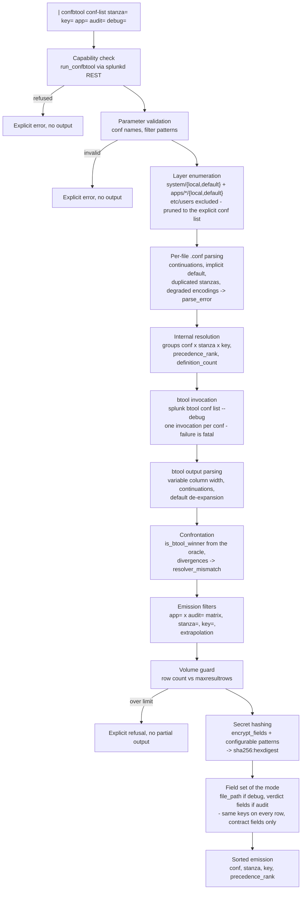

# SA-conf-audit

[](https://github.com/rafiki31130/SA-conf-audit/actions/workflows/ci.yml)

**btool as a search command.** `| confbtool` audits the file origin of every
Splunk configuration definition - winners and shadowed alike - in SPL, on the
member where the search runs.

For every `(conf, stanza, key)` it emits one row per *definition* (one file
that defines the key), with the file path, the global precedence rank, and the
verdict of a real `splunk btool <conf> list --debug` execution. The "winner"
verdict is **never** a reimplementation of the precedence rules: btool itself
is invoked as the oracle, and any disagreement between the internal ranking
and btool surfaces as an explicit `resolver_mismatch` row - the command
validates itself on every run.

The driving use case: on a search head, the effective precedence of a
parameter is opaque and shadowed definitions are invisible with native tools.
Auditing an app before removal - *what, in this app, is dead because another
layer shadows it?* - has no native answer. `| confbtool * app=<the_app>
audit=true` gives it in one search.

## Requirements

- Splunk Enterprise 9.x, on-premise (validated on 9.4.6). Not suitable for
  Splunk Cloud: the command executes the `splunk btool` binary and reads
  `$SPLUNK_HOME/etc` directly.
- Python 3 (the platform's `python.version = python3`). The Splunk SDK for
  Python is vendored under `bin/lib/` - no network access, no external
  dependency at install or run time.

## Installation

1. Package or copy the app into `$SPLUNK_HOME/etc/apps/SA-conf-audit` (the
   deployable archive carries `default/`, `bin/`, `metadata/`, `README.md`,
   `LICENSE`).
2. Restart Splunk (a new search command and a new capability are declared).
3. Nothing else: the app grants the `run_confbtool` capability to the `admin`
   role out of the box (`default/authorize.conf`), and exports the command
   globally (`metadata/default.meta`, `export = system`) so that it can be
   invoked from any app - the Search app in particular. Without that export a
   search command is only usable from the context of the app that ships it.

The command is **admin-only by design**: it exposes the file origin of every
configuration parameter, which is administration data. Execution requires the
`run_confbtool` capability, checked at run time before any file is read.

### Granting the command to another role

Two steps, both local decisions (never shipped by the app):

1. Grant the capability in your own `authorize.conf`:

   ```ini
   [role_your_role]
   run_confbtool = enabled
   ```

2. Extend the app's visibility: `metadata/default.meta` restricts read access
   to the `admin` role, and Splunk `.meta` files restrict by **role**, not by
   capability. Add to `SA-conf-audit/metadata/local.meta`:

   ```ini
   []
   access = read : [ admin, your_role ], write : [ admin ]
   ```

   Without this second step the role holds the capability but does not see
   the command. The effective protection remains the run-time capability
   check; visibility is an interface comfort.

## Syntax

```
| confbtool <conf|conf,conf|*> [stanza=<pattern>] [key=<pattern>]
            [app=<pattern>] [audit=<bool>] [debug=<bool>]
```

- The conf list is positional and mandatory: one name (`authorize`), a comma
  or space separated list (`props,transforms`), or `*` for every conf present
  on disk.
- `stanza=`, `key=`, `app=` accept literal characters plus the wildcards `*`
  (any substring) and `?` (one character), case-sensitive. Defaults:
  `stanza=*`, `key=*`, `app=` absent.
- `audit=` defaults to `false`. `debug=` defaults to **`false`**: the
  `file_path` field is then **not emitted at all** - not emitted empty. A
  field that is not relevant in a mode is absent from the results, because an
  empty column stays visible in a result table and makes the option look
  inert.
- **`audit=true` implies `debug=true`**: reading a conflict without the path
  makes no sense, so an explicit `debug=false` is ignored in audit mode.

### `stanza=` and `key=` match the source spelling, not the btool spelling

The `stanza` and `key` columns carry the **literal writing of the source
file**; `btool --debug` displays a *normalised* one (see [The btool output is a
normalised view](#the-btool-output-is-a-normalised-view-not-an-echo)). The
filters compare against the emitted, literal spelling - so a stanza name
copied from a `btool` CLI session can match nothing. Measured on 9.4.6:

```
| confbtool inputs stanza="monitor:///opt/splunk/var/log/splunk/editacl.log" audit=true
  -> 0 definitions          (the spelling btool prints)

| confbtool inputs stanza="monitor://$SPLUNK_HOME/var/log/splunk/editacl.log" audit=true
  -> 3 definitions          (the spelling the file carries)
```

Copy-pasting from the CLI is the natural gesture with this tool, and it
returns an empty result with no message. When a filter comes back empty, run
the command without it and look at the `stanza` column: what it shows is what
the filter has to match. The same applies to the relative scheme paths and the
doubled backslashes of the table further down.

### `anomaly` rows are scoped by the filters, each by what it knows

Anomaly rows are the command's self-validation channel: a filter must not be
able to hide the fact that the tool disagrees with the oracle **about what you
asked for**. That guarantee is scoped, not global - each kind of row is scoped
by what it actually knows:

| Row | Scoped by |
|---|---|
| `resolver_mismatch` | like a definition: `<conf>`, `stanza=`, `key=` and `app=`. It carries a known `(conf, stanza, key)`, so its perimeter is determinable. `app=` is evaluated on the group, so an anomaly on a key the app takes part in surfaces even in the default mode, where that group may emit no row at all |
| `parse_error` | **conf only**. The file could not be read, so which stanzas and keys it carried is unknown - silencing it inside its own conf would answer "nothing here" without knowing. `stanza=`, `key=` and `app=` never exclude it |

Neither is affected by `audit=`: both are emitted in every mode.

Inside the perimeter you asked for, an anomaly is unmaskable. Outside it, it no
longer pollutes an answer it does not concern:

```
| confbtool inputs app=splunk_secure_gateway audit=f
             stanza="ssg_kvstore_upgrade://default"
  -> 1 row: the definition asked for.
     The 4 [journald] resolver_mismatch rows of another app are out of scope.
     They still show up in | confbtool inputs, and in | confbtool *.
```

`| where anomaly=""` restricts to definitions when needed - and the count of
`| where anomaly!=""` on an unfiltered scan is what you want to watch anyway.

### The `app=` x `audit=` matrix

|  | `audit=false` (default) | `audit=true` |
|---|---|---|
| **without `app=`** | winning definitions only, one row per key | **every** concurrent definition, winners and shadowed |
| **with `app=`** | winning definitions located in a matching app | **extrapolation**: for every key the matching app(s) carry, every concurrent definition is emitted - other apps and the `system` layers included |

Extrapolation is the audit mode: `app=` selects the *keys* (those where the
app carries at least one definition), and the emission then covers the whole
competition on those keys. A key the app does not carry never appears.
Filters never prune the analysis: rank, winner verdict and definition count
are always computed on the real, complete set of layers.

### Output fields (one event per definition)

| Field | Emitted | Meaning |
|---|---|---|
| `file_path` | `debug=true` **or** `audit=true` | absolute path of the file carrying the definition |
| `conf` | always | conf name, without the `.conf` |
| `stanza` | always | stanza name (`default` for keys written before any header) |
| `key` | always | parameter name |
| `value` | always | value, folded into one logical value, hashed if sensitive |
| `scope` | always | `system` or `app` |
| `app` | always | app name; **`system`** for `etc/system/{local,default}` |
| `layer` | always | `local` or `default` |
| `precedence_rank` | always | rank in the global precedence order, 1 = strongest |
| `is_btool_winner` | `audit=true` | `true`/`false`, the btool verdict |
| `btool_winner_path` | `audit=true` | the winner, repeated on every row of the group |
| `btool_winner_value` | `audit=true` | idem |
| `definition_count` | always | number of concurrent definitions of `(conf, stanza, key)` |
| `member` | always | hostname of the member that ran the search |
| `anomaly` | always | empty, `parse_error` or `resolver_mismatch` |

In the default mode the three verdict fields would be constant
(`is_btool_winner` is always `true` when only winners are emitted) or
redundant with `file_path` and `value` of the very same row, so they are not
emitted. `precedence_rank` and `definition_count` **are** emitted in every
mode: they are what tells you a key is contested and worth a second look in
`audit=true`.

The output is strictly flat - directly usable by `stats`, `where`, `eval`,
without transformation. `| stats count by app` is right with no `eval` fix-up,
including for the system layer. Note that `app=` stays a filter on **apps**:
`app=system` selects nothing, `| where scope="system"` is the predicate for
that layer.

### Records, not events

`| confbtool` is a **generating** command, never an event-generating one. Its
output is a set of records - the flat contract above and nothing else. **No
`_raw` and no `_time` are ever produced**: a configuration definition has no
raw text and no timestamp, and none is invented. Results land in the statistics
table, the job reports **no** events (`eventCount = 0`, an empty `/events`
endpoint), and a search over this output must not rely on a time range.

The command declares `type = reporting`, like the built-in generating commands
that yield results (`| makeresults`, `| rest`). This is measured, not assumed:
with the SDK default the metadata reads `stateful` and Splunk routes the output
through the events pipeline anyway (`eventCount = resultCount`, `/events`
serving the rows). A reporting command cannot be distributed either, but
`distributed=false` is declared explicitly all the same - see *Known limits*.

## Typical audits

Winning `authorize.conf` definitions - add `debug=true` for the file origin:

```
| confbtool authorize debug=true
```

Full competition on one key - who wins, who is shadowed, from where:

```
| confbtool web key=mgmtHostPort audit=true
```

Dead definitions of an app (shadowed by another layer), each with the
shadowing file - the audit before an app removal:

```
| confbtool * app=00_corp_base audit=true
| where is_btool_winner="false" AND app="00_corp_base"
```

Every key where `system/local` overrides an app (deployment hygiene):

```
| confbtool * audit=true
| where scope="system" AND layer="local" AND definition_count>1
```

Self-validation check - must return nothing on a healthy instance:

```
| confbtool * | where anomaly!=""
```

## How it works



Layer precedence, the one btool applies outside of any app/user context:
`system/local` > `apps/*/local` > `apps/*/default` > `system/default`; inside
an apps tier, the app **first in ASCII ascending order** wins (`00_corp_base`
beats `zz_sample_app`).

A key defined in a `[default]` stanza is emitted **once, at its literal
origin** (`stanza=default`) - never repeated per inheriting stanza the way
the expanded btool view does. The btool output is de-expanded before the
confrontation.

The de-expansion takes its reference set from the **source files**, not from
the `[default]` stanza of the btool output. Measured on 9.4.6 over 76 conf
types: `btool <conf> list --debug` prints a `[default]` stanza header whenever
a source file declares one - **except for `inputs`**, where the header is
suppressed although the inheritance is still expanded into every stanza. A
de-expansion keyed on the printed header therefore recognises nothing on
`inputs` and turns every inherited key of every stanza into a
`resolver_mismatch`. Rule applied instead: a btool line of a stanza
`S != default`, of triplet `(path, key, value)`, is an inheritance repetition
if and only if the file at that path carries, in our reading, a `[default]`
definition of the same key and value **and** carries no `(S, key)` definition
of its own. Such a line is folded back onto its literal origin, which is also
how the `[default]` verdict is recovered when btool withholds the header.

The same fold covers a second inheritance relation, measured the same way: a
bare `[<scheme>]` stanza of `inputs.conf` holds the defaults of every
`[<scheme>://<instance>]` of that scheme. btool **never** prints the bare
header and expands its keys into each instance, with the path of the file
declaring the bare stanza. The line is folded back onto `(<scheme>, key)`.

### The btool output is a normalised view, not an echo

`btool --debug` rewrites part of what it reads. Comparing a literal spelling
with a normalised one manufactures a false `resolver_mismatch` everywhere
Splunk normalises something, so the command **normalises both sides to
compare and emits the literal spelling** - the `stanza` and `key` columns
always carry the source file's own writing. Three normalisations are measured
on 9.4.6 and applied to the comparison only:

| What btool rewrites | Example | Measured on |
|---|---|---|
| `$SPLUNK_HOME` in a stanza name | `[monitor://$SPLUNK_HOME/var/log/splunk]` -> `[monitor:///opt/splunk/var/log/splunk]` | 60 stanzas of `inputs`, 60 explained, 0 left over |
| a relative scheme path | `[script://./bin/x.py]` -> the absolute path under the declaring app's directory | idem |
| a doubled backslash in a **key name** | `L-..._\\"\\"_L7(` -> `L-..._\"\"_L7(` | 75 keys of `sourcetypes`, 75 explained; the 21 values of the corpus carrying `\\` are restituted byte for byte |

A fourth measured behaviour concerns the parser rather than the comparison:
btool emits a definition line **with no path prefix at all** when it cannot
attach an inherited `[default]` value to any file - it happens for a stanza
whose input scheme it does not recognise, which gets `host` and `index`
printed at column 0. Read naively, such a line looks like the continuation of
a multi-line value and its text gets appended to the previous value. The
command recognises it by its content: a path-less line reading as
`<key> = <value>` whose pair is one of the conf's own `[default]` definitions
has no source file, therefore no origin to report, and is dropped.

### Safety properties

- **Read-only**: the command writes nothing but its own log file
  (`$SPLUNK_HOME/var/log/splunk/sa_conf_audit.log`).
- **No silent truncation**: if the run would emit more rows than the
  instance's `maxresultrows` (read from `limits.conf`, not hardcoded), the
  command refuses with an explicit message naming the filters to apply. A
  truncated audit would read as missing definitions.
- **No cleartext secret**: values of sensitive keys - the `encrypt_fields`
  list of `server.conf`, plus configurable patterns in `confbtool.conf`
  (`*password*`, `*secret*`, `*token*`, `credential*` stanzas, ...) - are
  replaced by `sha256:<hexdigest>` in results. Equal values keep equal
  digests, so cross-layer comparison survives the masking. The log file never
  carries any configuration value at all. The complementary patterns, and
  only they, are switched off on the confs of `pattern_excluded_confs`
  ([why](#why-some-confs-are-exempt-from-the-key-patterns)).
- **Robustness**: an unreadable or undecodable file never aborts the run; it
  yields an `anomaly=parse_error` row - scoped by conf, never excluded by
  `stanza=`, `key=` or `app=` - and the rest of the audit is unaffected.

## Configuration (`confbtool.conf`)

Ship nothing: the defaults are functional. To override, create
`SA-conf-audit/local/confbtool.conf`:

```ini
[secrets]
# Complements encrypt_fields (server.conf), always read at runtime.
extra_key_patterns = pass4SymmKey, sslPassword, *password*, *secret*, *token*
extra_stanza_patterns = credential*
# Confs where the two lists above do not apply. Exact names, no globs.
pattern_excluded_confs = authorize, collections, fields, multikv, sourcetypes, web-features

[logging]
# CRITICAL | ERROR | WARNING | INFO | DEBUG
level = INFO

[rest]
# TLS verification of the loopback splunkd calls.
verify_ssl = true
```

### Why some confs are exempt from the key patterns

Substring patterns such as `*token*` match a **name**, and plenty of names
carry `token` or `password` without the value being a secret. Masking those
costs readability and protects nothing: `sha256("enabled")` is recovered with
a one-line dictionary. `pattern_excluded_confs` therefore switches the
complementary patterns off on confs whose value space cannot hold a
credential. Measured on a stock 9.4.6 instance, the shipped list accounts for
50 of the 83 masked values:

| Conf | Masked | Why the value cannot be a secret |
|---|---|---|
| `sourcetypes` | 29 | machine-generated file-classifier bundle: the keys are *terms observed in the sampled logs*, the values their frequency (`password = 0.001104`) |
| `authorize` | 11 | capabilities, roles and quotas; `edit_token_http = enabled` is a switch, and this is the conf an administrator audits first |
| `multikv` | 4 | closed extraction schema (`<section>.start/.end/.member/.linecount/.tokens`); `.tokens` names a tokenizer (`_tokenize_`), not a credential |
| `web-features` | 3 | boolean feature flags only |
| `collections` | 2 | KV-store schema: `field.<name>` declares a *type* (`string`), `accelerated_fields` an index spec |
| `fields` | 1 | three attributes, all extraction semantics: `TOKENIZER` (a regex), `INDEXED`, `INDEXED_VALUE` |

Two guardrails come with it:

- **`encrypt_fields` is never excluded.** A key the platform declares
  encryptable stays masked even in a listed conf, so an exclusion cannot
  unmask a secret the instance itself designates.
- **Exact names, no globs.** An exclusion must not be able to grow wider than
  what was demonstrated for it.

The confs left out of the list are left out on purpose. `authentication`,
`server`, `web` and `app` all carry real credentials - `encrypt_fields` names
`app:credential:password` and `authentication: :bindDNpassword` explicitly -
so their policy keys (`minPasswordLength`, `invalidateSessionTokensOnLogout`,
`reload.passwords`) stay masked rather than open the conf. Over-masking is a
comfort defect; under-masking is a safety one. Set the list to empty to get
the pre-1.1.0 behaviour back.

## Known limits

- **Single member**: the command runs on the member executing the search and
  audits that member's file system only. No cross-member collection, no fleet
  aggregation. Non-distribution is declared three times over, on purpose:
  `distributed=False` explicitly on the command class, a `reporting` type that
  the SDK will not distribute, and `local = true` in `commands.conf`.
- **Global resolution only**: the resolution is the one of `btool` outside of
  any app or user context. `etc/users` is excluded by design - a user-layer
  definition has no rank in the global precedence order. No `--user`-style
  mode in this version.
- **Disk truth, not running config**: the command reads the files, exactly
  like btool. A parameter changed on disk but not reloaded (or the reverse)
  is reported as the disk sees it. The same applies to the volume limit,
  read from `limits.conf` on disk.
- **Deactivated apps are excluded**: an app whose `[install] state` resolves
  to anything other than `enabled` takes no part in the resolution, which is
  the behavior measured on the validated version of btool. A divergence would
  surface as `resolver_mismatch`.
- **A bare scheme stanza with no instance gets no btool verdict**: a
  `[<scheme>]` stanza of `inputs.conf` holds the defaults of the
  `[<scheme>://<instance>]` stanzas of that scheme. When no instance exists,
  btool prints **nothing at all** for it - there is no line to expand into,
  and no header either. The command still reports the definitions (they are in
  a file, which is what the command is about) but the oracle designates no
  winner, so each key yields one `resolver_mismatch`. This is a legitimate,
  named residue - an app shipping `[journald]` without any `[journald://...]`
  input produces four such rows on the validated version - not a defect of the
  command. Silencing it would require embedding splunkd's internal table of
  recognised input types, which is neither observable from btool nor stable
  across versions.
- **`parse_error` can entail legitimate `resolver_mismatch`**: on a file with
  a degraded encoding, the command extracts what it can and btool parses the
  file its own way; the two views may differ. Those `resolver_mismatch` rows
  are a signal about the broken file, not a defect of the command.
- **AppInspect**: designed for on-premise deployment; the app executes an
  external binary and reads `$SPLUNK_HOME/etc`, which is structurally
  incompatible with Splunk Cloud vetting.

## Development

The whole logic lives in `bin/confaudit/`, a library with three enforced
layers (pure core / adapters / Splunk wrapper); `bin/confbtool.py` only wires
them. The test suite runs outside Splunk, without network access:

```
python -m unittest discover -s tests
```

`tests/fixtures/` carries a synthetic reference conf set and a simulated
btool output conforming to the measured `--debug` format.
`tests/labdata/` carries a synthetic **exploration** data set for a lab
instance - the same stanzas and keys defined across several apps and layers,
with a README listing the searches that show each case, and a script that
deploys and removes it in one gesture. `tools/vendor.sh`
rebuilds the vendored SDK reproducibly; `tools/verify_vendor.sh` checks it
against `bin/lib/MANIFEST.sha256`.

### Build pipeline

`.github/workflows/ci.yml` runs on every push and every pull request, in three
jobs:

| Job | What it does |
|---|---|
| `lint` | `ruff check .` (pinned version, config in `ruff.toml`, vendored SDK excluded), then re-reads every `default/*.conf` with the app's own parser - a malformed conf file is invisible to a Python linter and fatal at run time |
| `test` | `python -m unittest discover -s tests` on Python 3.9 (the interpreter Splunk 9.4 embeds), 3.11 and 3.13, plus `tools/verify_vendor.sh` |
| `package` | builds the `.spl`, asserts its five roots and the absence of `tests/`, `tools/` and `.github/`, publishes its sha256 in the job summary and uploads it as an artifact |

The packaging step runs **the same `git archive` command as the release
procedure** on the same tree, so the artifact of a run and the asset of a
release built from that commit are the same bytes:

```
git archive --format=tar.gz --prefix=SA-conf-audit/ -o SA-conf-audit-<version>.spl \
  <commit> -- default bin metadata README.md LICENSE
```

No secret is used: the workflow only reads the checked-out tree, and the
`contents: read` permission is all it is granted. Locally, `ruff check .` and
`python -m unittest discover -s tests` reproduce the two first jobs exactly.

## License

Apache-2.0 (see `LICENSE`). The vendored Splunk SDK for Python is Apache-2.0
as well (`bin/lib/VENDOR.md`).
